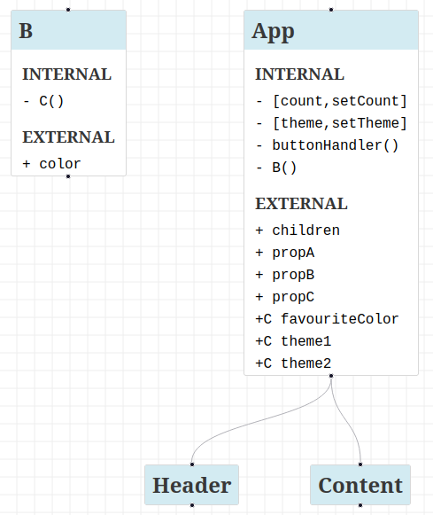

# react-diagram-visualizer

A tool to visualize React applications through an interactive UML-style architectural diagram, powered by [ReactFlow](https://reactflow.dev/).

**What This Tool Offers:**

- Unlike manual tools like [Mermaid](https://mermaid.js.org/) and [Draw.io](https://app.diagrams.net/), `react-diagram-visualizer` can auto-generate an informative diagram in a single command.
- Generates diagrams through static analysis of your source files, no code execution required.
- Visualizes React component hierarchies and component metadata (states, functions, and props).

**Enterprise Features**:

- Planning to support node grouping by file path and collapsible nodes for large codebases (50+ components), using [`elkjs`](https://github.com/kieler/elkjs) layouts.
- Planning to add performance metrics for 50+ component diagrams (e.g., rendering time) post-MVP testing.
- For more information about post-MVP and planned features, visit [`ROADMAP.md`](https://github.com/AmiraBasyouni/react-diagram-visualizer/blob/main/ROADMAP.md).

## Quick Start

[_▶️ Visit this link to watch the quick demo in full resolution on YouTube_](https://youtu.be/I9kxUosEFdU)
  
_A short demo where `react-diagram-visualizer` generates an architectural diagram of a React application._

> In the short demo, the visualizer was given an App component within the current directory. The visualizer constructed the dependency tree, collected the metadata of all the components, and presented a UML-styled architectural diagram of the React application.

> Note, the App component helped us visualize the entire application. We could have targeted a different component, like Button or ToastShelf, to visualize only specific parts of that application.

To target a component that is default exported,  
run this command in the component's directory:

```bash
npx react-diagram-visualizer ./
```

To target a component that is not default exported,  
you must include the name of the component (e.g. Button):

```bash
npx react-diagram-visualizer ./ Button
```

## Arguments

Run the visualizer with the following arguments:

1. **(required)** `<entryDirectory>` or `<entryFile>`  
   Path to your application's entry directory or entry file.  
   Example: `./src/` or `./src/index.js`

2. _(optional)_ `[rootComponentName]`  
   Name of the React component you'd like to target for visualization.  
   Example: `App`  
   If omitted, the tool tries to fall back on a default exported function.  
   The default export can be derived from the `<entrydirectory>`  
   (by searching index files: `index.tsx`, `index.ts`, `index.jsx`, and `index.js`)  
   or the default export can be derived from the `<entryFile>`.

## Example Usage

**Example Command:**  
`npx react-diagram-visualizer ./src/components App`

**Example Input File Content:**

```JS
import React from "react";
import FavouriteColorContext from "./FavouriteColorProvider";
import FavouriteThemeContext from "./FavouriteThemeProvider";

function App({ children, propA, propB, propC }) {
    const [count, setCount] = React.useState(0);
    const [theme, setTheme] = React.useState("");
    const favouriteColor = React.useContext(FavouriteColorContext);
    const { theme1, theme2 } = React.useContext(FavouriteThemeContext);
    function buttonHandler() {
      setCount(count + 1);
      setTheme("dark");
      B();
    }
    function B(color) {
      favouriteColor[color];
      console.log(theme1);
      console.log(theme2);

      function C() {}
      return C();
    }
    return (
      <>
        <Header propA={propA} propB={propB} propC={propC} />
        <main>
          <p>Typical app structure</p>
          {count}
          <button onClick={buttonHandler}>increment counter</button>
          <Content theme={theme}>{children}</Content>
        </main>
      </>
    );
  }

  function Header() {
    return <div></div>;
  }

  function Content() {
    return <p></p>;
  }

  export default App;

```

---

**Example Diagram Output:**

  
_An image that previews an interactive UML-style diagram that contains component metadata rendered using [ReactFlow](https://reactflow.dev)._

**Reading The Diagram:**

- Each node represents a React component.
- The **internal** list represents internally defined data (e.g. `[state, stateSetter]` and `nameOfFunction()`).
- The **external** list represents props. The **+C** symbol represents props derived through context (aka context props).

> Special Cases:  
> If a nested function starts with a capital letter (e.g., B inside App), it is treated as both an internal function and a component node. Functions nested inside those components (like C inside B) are listed as internal functions but do not become separate component nodes.

**Diagram interactions (MVP):**

- zoom
- drag nodes

**Post-MVP diagram interactions will include:**

- node clicking for file path details
- see [`ROADMAP.md`](https://github.com/AmiraBasyouni/react-diagram-visualizer/blob/main/ROADMAP.md) to learn more about future plans

## Specifications

**Project Dependencies:**

- [`react-diagram-schema`](https://github.com/AmiraBasyouni/react-diagram-schema) for generating the metadata.
- [`elkjs`](https://github.com/kieler/elkjs) for constructing the layout.
- [`ReactFlow`](https://reactflow.dev) for viewing the diagram.
- [`parcel`](https://parceljs.org/) for hosting the diagram locally on your machine.

**Node.js Version:**

- Node.js 18+ recommended (use `nvm use 18` if needed)

**Unique Features:**

- Seamlessly integrates with and leverages schemas from [`react-diagram-schema`](https://github.com/AmiraBasyouni/react-diagram-schema).
- Supports [`elkjs`](https://github.com/kieler/elkjs) layouts for hierarchical, scalable diagrams.

## Get Started

1. Install the most recent version globally:
   ```bash
   npm install -g react-diagram-visualizer
   ```

---

2. **Run** the diagram in the directory of the component you'd like to visualize. Either by running:

   ```bash
   react-diagram-visualizer ./
   ```

   if the component is default exported, or otherwise by explicitly stating the name of the component:

   ```bash
   react-diagram-visualizer ./ App
   ```

   > **Tip:**  
   > If you'd like to shorten the `react-diagram-visualizer` command, you can create an alias by running:

   ```bash
   echo "alias visualize='react-diagram-visualizer'" >> ~/.bashrc
   ```

   > Replace `~/.bashrc` with `~/.zshrc` depending on your terminal environment.  
   > Restart the terminal and run the visualizer using your alias.  
   > Example: `visualize <entryDirectory> [rootComponent]`

---

3. **View** the diagram at `http://localhost:1234` or the URL Parcel prints if 1234 is occupied.

## Troubleshooting Tips

- No diagram?
  - If your component is not default exported, make sure to specify the component name.
  - Ensure you've provided the correct directory.
- Port occupied? Check console output for the correct localhost URL.

## Roadmap

See `react-diagram-visualizer`'s [ROADMAP.md](https://github.com/AmiraBasyouni/react-diagram-visualizer/blob/main/ROADMAP.md) for feature plans and upcoming goals.

## Contributing

Please visit [CONTRIBUTING.md](https://github.com/AmiraBasyouni/react-diagram-visualizer/blob/main/CONTRIBUTING.md) to learn about how you can contribute to `react-diagram-visualizer`.

## License

MIT
