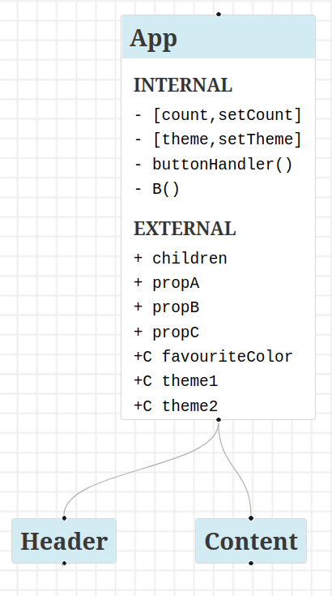

# react-diagram-visualizer

Parses a `schema.json` file generated by [`react-diagram-schema`](https://github.com/AmiraBasyouni/react-diagram-schema) and renders a visual representation of your React component structure using [ReactFlow](https://reactflow.dev/).

**🔦 What Makes It Unique:**  

- Unlike [Mermaid](https://mermaid.js.org/), `react-diagram-visualizer` specializes in React component hierarchies, leveraging schemas from [`react-diagram-schema`](https://github.com/AmiraBasyouni/react-diagram-schema).

- Seamlessly integrates with [`react-diagram-schema`](https://github.com/AmiraBasyouni/react-diagram-schema)’s schema, supporting [`elkjs`](https://github.com/kieler/elkjs) layouts for hierarchical, scalable diagrams.

**✨ Enterprise Features**:  
- Will support node grouping by filepath and collapsible nodes for large codebases (50+ components), using [`elkjs`](https://github.com/kieler/elkjs) layouts.  
- Performance metrics for 50+ component diagrams (e.g., rendering time) to be added post-MVP testing.
- For more information about post-MVP and planned features, visit [`ROADMAP.md`](https://github.com/AmiraBasyouni/react-diagram-visualizer/blob/main/ROADMAP.md).

## Example Usage
**🔌 To Install,**  
Clone the `react-diagram-visualizer` repository by running the following command:
```bash
git clone https://github.com/AmiraBasyouni/react-diagram-visualizer.git
```

---

**✏️ To Set Input File,**  
Place the `schema.json` file generated by [`react-diagram-schema`](https://github.com/AmiraBasyouni/react-diagram-schema) into the src directory of `react-diagram-visualizer` 

---

**Example Input File Content:** 
```JSON
{
  "App::../test-components/App.js": {
    "name": "App",
    "description": "",
    "descendants": [
      "Header::../test-components/Header.js",
      "Content::../test-components/App.js"
    ],
    "internal": {
      "states": [
        ["count", "setCount"],
        ["theme", "setTheme"]
      ],
      "functions": ["buttonHandler", "B"]
    },
    "external": {
      "props": ["children", "propA", "propB", "propC"],
      "context": [
        {
          "source": "FavouriteColorContext",
          "values": ["favouriteColor"]
        },
        {
          "source": "FavouriteThemeContext",
          "values": ["theme1", "theme2"]
        }
      ],
      "constants": []
    },
    "location": {
      "line": 7,
      "filepath": "../test-components/App.js"
    }
  },
  "Content::../test-components/App.js": {
   ✂ trimmed for simplicity...
  },
  "Header::../test-components/Header.js": {
   ✂ trimmed for simplicity...
   }
}
```
_Note: see [`react-diagram-schema`](https://github.com/AmiraBasyouni/react-diagram-schema)’s [`ROADMAP.md`](https://github.com/AmiraBasyouni/react-diagram-schema/blob/main/ROADMAP.md) for full schema details._

---

**Example Diagram Output:**  

An interactive UML-style diagram showing metadata stored in the `schema.json` file (e.g. React component hierarchies, components, descendants, props, and states) rendered with using [ReactFlow](https://reactflow.dev).


Interact with the diagram: zoom, and drag nodes. (MVP)  
Post-MVP features like node clicking for filepath details are planned (see [`ROADMAP.md`](https://github.com/AmiraBasyouni/react-diagram-visualizer/blob/main/ROADMAP.md))

_🗒 Note: Refresh the diagram (`Ctrl+c`, `npm run dev`) to reflect changes in `schema.json`_

## Prerequisite
Generate a `schema.json` using [`react-diagram-schema`](https://github.com/AmiraBasyouni/react-diagram-schema).

**Project Dependencies:**  
- [`ReactFlow`](https://reactflow.dev) for displaying the diagram
- [`elkjs`](https://github.com/kieler/elkjs) for generating the layout  
- Dependencies are installed via `npm install`

**Node.js Version:**  
- Node.js 16+ recommended (use nvm use 16 if using nvm)

## Quick Start

 After generating `schema.json` with [`react-diagram-schema`](https://github.com/AmiraBasyouni/react-diagram-schema), run `npm run dev` from the project root to view your diagram.

## Get Started

1. **Install** the repository:
   ```bash
   git clone https://github.com/AmiraBasyouni/react-diagram-visualizer
   ```

---

2. **Navigate** to the root folder:
   ```bash
   cd react-diagram-visualizer
   ```

---

3. **Install** required dependencies:
   ```bash
   npm install
   ```

---

4. **Move** a copy of your generated `schema.json` file **into the src directory** of `react-diagram-visualizer`: 
 
   - 🗒 Note:  
    the following command assumes `react-diagram-schema`’s `schema.json` is in a sibling directory’s `./src/`. Adjust the path if needed.  

    ```bash
    cp ../../react-diagram-schema/src/schema.json ./src/
    ```

---

5. **Run** the diagram:
   ```bash
   npm run dev
   ```

---

6. **View** the diagram at `http://localhost:1234` or the localhost provided by parcel when 1234 is occupied

---

## Troubleshooting Tips

- No diagram? Ensure `schema.json` is in `./src/`. 
- Port occupied? Check `npm run dev` output for the correct localhost URL.

## Roadmap

See `react-diagram-visualizer`'s [ROADMAP.md](https://github.com/AmiraBasyouni/react-diagram-visualizer/blob/main/ROADMAP.md) for feature plans and upcoming goals.

## License

MIT

